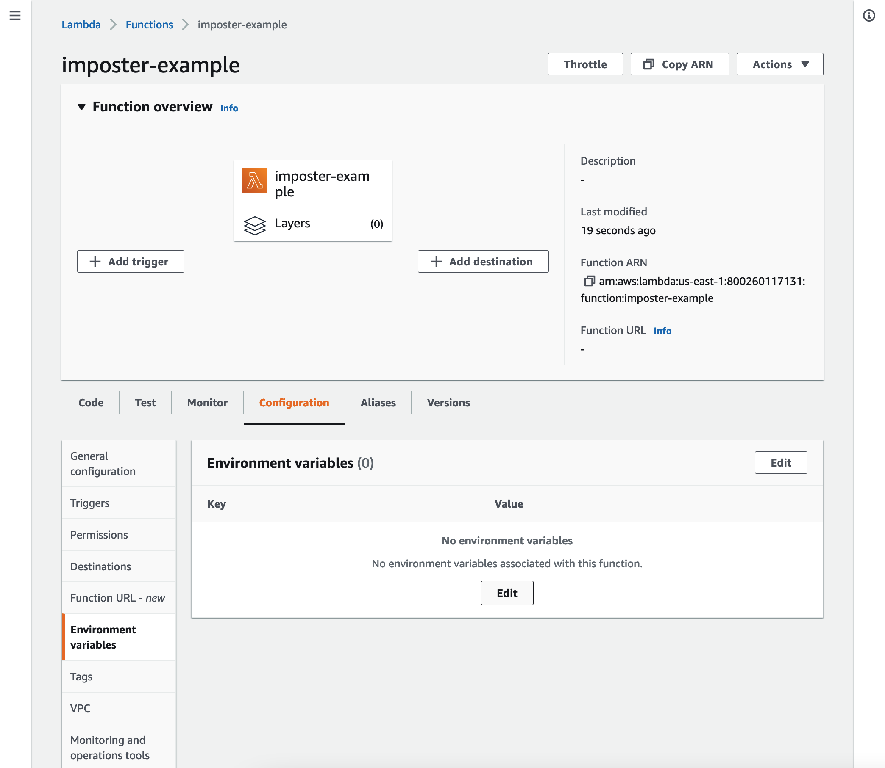
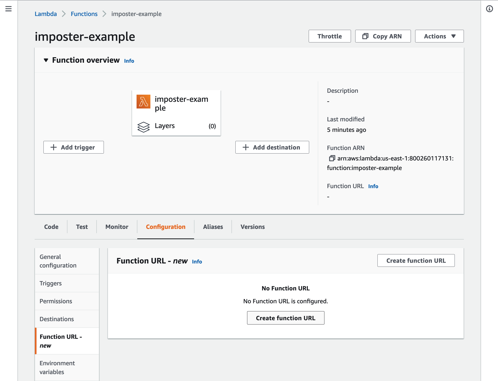

# Running Imposter in AWS Lambda

There are many ways to run Imposter. This section describes how to run it as a Lambda function in AWS.

---
### Other ways to run Imposter

#### Standalone mock server

- Using the command line client - see [Imposter CLI](./run_imposter_cli.md)
- As a Docker container - see [Imposter Docker container](./run_imposter_docker.md)
- As a JAR file on the JVM - see [Imposter JAR file](./run_imposter_jar.md)

#### Embedded in tests

- Embedded within your **Java/Kotlin/Scala/JVM** unit tests - see [JVM bindings](./embed_jvm.md)
- Embedded within your **JavaScript/Node.js** unit tests - see [JavaScript bindings](https://github.com/gatehill/imposter-js)

---

## AWS Lambda Features

- Start mocks
- Access mock server via Lambda function URL (or AWS API Gateway)
- Supports [OpenAPI](./openapi_plugin.md), [REST](./rest_plugin.md) and [SOAP](./soap_plugin.md) mocks

You can deploy Imposter as a [Lambda function](https://docs.aws.amazon.com/lambda/latest/dg/java-package.html) in various ways, such as the AWS Console, using infrastructure as code (e.g. Terraform) or a framework such as Serverless.

Another option is to use the [Imposter CLI](./run_imposter_cli.md), which has some opinionated choices to make things easier. You should choose the option that best suits your environment.

## Deploy to Lambda using Imposter CLI

You can deploy Imposter as a Lambda function using the Imposter CLI.

> **Note**
> If you want to deploy using infrastructure as code tools, such as Terraform, or the AWS Console, see the 'Other ways to deploy to Lambda' section.

The key steps are:

- use the Imposter CLI to create a ZIP bundle containing your configuration and the Imposter Lambda function
- use the Imposter CLI to deploy the bundle as a Lambda function to the desired AWS region, providing any custom IAM roles etc.
- access the Lambda function via a Lambda Function URL

### Prerequisites

- You must have an AWS account and permission to deploy Lambda functions, fetch an IAM role (and optionally create a role if not using an existing role).
- You must install the [Imposter CLI](./run_imposter_cli.md).

### Deploy to AWS Lambda

For the purposes of this guide, we will assume your working directory contains an Imposter configuration file.

> **Note**
> See the [Configuration section](./configuration.md) for more information.

```shell
$ ls -l
mock-config.yaml   response.txt
```

#### Step 1: Prepare your workspace

To begin, create a _workspace_ in this directory:

```shell
$ imposter workspace new example

created workspace 'example'
```

A workspace holds configuration, such as details of the remote deployment. You can commit your workspace directory to your source control system (by default, stored under the `.imposter` subdirectory).

> You can always check the active workspace by running the `imposter workspace show` command:
> ```shell
> $ imposter workspace show
> 
> active workspace: example
> ```

#### Step 2: Configure the remote

Set the remote type to AWS Lambda:

```shell
$ imposter remote set-type awslambda

set remote type to 'awslambda' for remote: example
```

Once you have the remote type, you can further configure the remote using the `imposter remote config` command, including:

- `functionName` - the name of the AWS Lambda function, which **must adhere** to the [AWS function naming rules](https://docs.aws.amazon.com/lambda/latest/dg/API_CreateFunction.html#SSS-CreateFunction-request-FunctionName)
- `region` - the AWS Region in which to deploy the function, such as `eu-west-1`
- `iamRoleName` - the name of a custom IAM Role for the Lambda's execution role
- `engineVersion` - the version of the Imposter engine to use, such as `3.2.1`
- `memory` - the amount of memory, in megabytes, for the function, such as `768`
- `anonAccess` - whether to permit anonymous access to the Lambda invocation endpoint (`true`|`false`)

#### Step 3: Deploy to Lambda

Now the remote is configured, deploy the Lambda function:

```shell
$ imposter remote deploy
```

> **Note**
> The deploy command uses the standard AWS mechanisms for locating credetials. For example, you may have set environment variables, or use the `~/.aws/` directory, or an instance role if running within EC2.
>
> If you receive a credential error, check that:
> - you have active AWS credentials, e.g. run `aws iam get-user`
> - you have the permissions described in the _Prerequisites_ section

Deployment may take a minute or so, depending on your connection speed, but it should look similar to:

```
deploying workspace 'example' to awslambda remote
bundling 2 files from workspace
created function: example with arn: arn:aws:lambda:us-east-1:123456789:function:example
deployed workspace 'example'
Base URL: https://url-to-invoke-lambda-function
Status: https://url-to-invoke-lambda-function/system/status
```

#### Step 4: Test your Lambda

If all has gone well, you should be able to reach your Lambda function using the status URL:

```shell
$ curl https://url-to-invoke-lambda-function/system/status

{ "status": "ok" }
```

You should be able to call your mock endpoints, such as:

```shell
$ curl https://url-to-invoke-lambda-function/

Hello world!
```

If you need to change a configuration option, such as memory, use the `imposter remote config` command and then run `imposter remote deploy` again.

> **Note**
> If you change the function name of your Lambda after deployment, future deployments will use the new name. This means that the old function with the previous name will still exist. Depending on your use case this may or may not be what you want to happen.

---

## Other ways to deploy to Lambda

You can also deploy Imposter as a Lambda function using the AWS Console, infrastructure as code tools (e.g. Terraform) or a framework such as Serverless.

The key steps are:

- you upload the Imposter JAR file and your configuration files to than S3 bucket
- you create a Lambda function using the JAR file as the code source
- you set the environment variables of the function to refer to the configuration path in S3
- you access the Lambda function via a Lambda Function URL or Amazon API Gateway

### Prerequisites

You must have an AWS account and permission to deploy Lambda functions, create/write to an S3 bucket, and configure API Gateway.

#### Upload configuration to S3 bucket

We are going to store the Imposter configuration files in an S3 bucket. Upload your configuration files to the S3 bucket, under a path such as `config`.

For the purposes of this guide, we will assume you have uploaded the configuration to a bucket named `example-imposter-bucket`, so the full path to the configuration file would be:

```
s3://example-imposter-bucket/config/imposter-config.yaml
```

You may add related files here, such as response files, specifications etc.

```
s3://example-imposter-bucket/config/openapi-spec.yaml
s3://example-imposter-bucket/config/response.json
...
```

---
### Option A: Using the AWS Web Console

This method uses the AWS Web Console to create a Lambda function, and enables you to call it using the Lambda Function URL.

#### Step 1: Upload Imposter to an S3 bucket

The Imposter engine for AWS Lambda is packaged as a JAR file. You should upload this file to an S3 bucket, from where it will be referenced by your Lambda function.

Open the [AWS S3 Console](https://s3.console.aws.amazon.com/s3/home). Upload the `imposter-awslambda.jar` file from the [Releases page](https://github.com/outofcoffee/imposter/releases/latest) to an S3 bucket.

For the purposes of this guide, we will assume you have uploaded the JAR file to a bucket named `example-imposter-bucket`, so the full path to the file would be:

```
s3://example-imposter-bucket/imposter-awslambda.jar
```

#### Step 2: Create your Lambda function

Open the [AWS Lambda Console](https://eu-west-1.console.aws.amazon.com/lambda/home). Create a new function using the file you uploaded to S3 as the code source.

*Important:* Set the following:

- runtime: `Java 11`
- architecture: `x86_64`


#### Step 3 Set handler

Under **Runtime settings** set the handler to: `io.gatehill.imposter.awslambda.HandlerV2`


#### Step 3 Set environment variables

Under **Configuration**, add the following environment variable:

```
IMPOSTER_S3_CONFIG_URL="s3://example-imposter-bucket/config/"
```

Set the environment variable to point to the path holding the configuration files:

> Note: this is not the path to the YAML _file_ - it is the directory ('prefix') under which the file exists in the bucket.

*Important:* Ensure the Lambda execution role has permission to access the S3 bucket containing your configuration.

See [deploy/example/bucket-policy.json](https://raw.githubusercontent.com/outofcoffee/imposter/main/distro/awslambda/deploy/example/bucket-policy.json) for an example IAM role.



#### Step 4 Enable function URL

Under **Configuration**, enable the 'Function URL' option - this will create an HTTPS endpoint for you to access Imposter.



Once you have created it, you should see the Function URL:


#### Step 5 Call the function

Invoke the Imposter function:

    curl https://<Lambda Function URL>/system/status
---
### Option B: Using Serverless framework

This method uses the [Serverless framework](https://www.serverless.com/framework) to create a Lambda function, and enables you to call it using the Lambda Function URL.

#### Step 1: Install Serverless framework

Install the Serverless framework:

    npm install -g serverless

> See the [Serverless framework getting started](https://www.serverless.com/framework/docs/getting-started) documentation.

#### Step 2: Download the JAR file

Download the `imposter-awslambda.jar` file from the [Releases page](https://github.com/outofcoffee/imposter/releases/latest).

#### Step 3: Configure the function

Create the following configuration file, named `serverless.yml`:

```yaml
service: aws-imposter-example
frameworkVersion: '3'

provider:
  name: aws
  runtime: java11

  # permit the function to fetch the config from an S3 bucket named 'imposter-lambda-example'
  iamRoleStatements:
    - Effect: "Allow"
      Action: "s3:GetObject"
      Resource: "arn:aws:s3:::imposter-lambda-example/*"
    - Effect: "Allow"
      Action: "s3:ListBucket"
      Resource: "arn:aws:s3:::imposter-lambda-example"

package:
  individually: true

functions:
  imposter:
    handler: "io.gatehill.imposter.awslambda.HandlerV2"
    timeout: 30
    url: true
    package:
      artifact: "./imposter-awslambda.jar"
    environment:
      IMPOSTER_S3_CONFIG_URL: "s3://imposter-lambda-example/config/"
```

> Note: `IMPOSTER_S3_CONFIG_URL` is not the path to the YAML _file_ - it is the directory ('prefix') under which the file exists in the bucket.

*Important:* Ensure the Lambda execution role has permission to access the S3 bucket containing your configuration.

See [deploy/example/bucket-policy.json](https://raw.githubusercontent.com/outofcoffee/imposter/main/distro/awslambda/deploy/example/bucket-policy.json) for an example IAM role.

Deploy your Lambda function with the Serverless CLI:

    serverless deploy

#### Step 4: Call the function

Invoke the Imposter function:

    curl https://<Lambda Function URL>/system/status

---

## What's next

- Learn how to use Imposter with the [Configuration guide](configuration.md).
